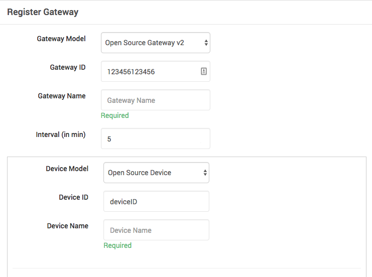

# Getting Started with the Thing+ REST APIs

## Step 1. Service set up
  - Register a Thing+ service at [https://iot.thingplus.net/#/register](https://iot.thingplus.net/#/register)
      - Or, your service may have already have been set up by our team, if you are a commercial partner
  - If you are making an app, make sure your application can receive web requests from Thing+ (i.e. It has a public IP or URL)
  > NOTE: Please check your Thing+ service's location before continuing
  - api.thingplus.net - This is the main API server - if you registered your own service, this will be the API server you should use
  - api.thingplus.eu - This is the EU API server
  - api.sandbox.thingplus.net - This is a commercial API test server from Seoul.
  - service-name.your-domain.com/api - If you have signed up for our custom domain service
  **You MUST ensure that you use the correct API server, depending on where your service (SERVICE_NAME.thingplus) is registered**

## Step 2. Prepare Postman

### 2.1. Postman for getting started with the Thing+ REST API
  - Install [Google Chrome](http://www.google.com/chrome)
  - Install <a href="https://www.getpostman.com/docs/introduction" target="_blank">Postman</a>. <a href="https://chrome.google.com/webstore/detail/postman/fhbjgbiflinjbdggehcddcbncdddomop" target="_blank">Direct link for Chrome browser users</a>
  - You don't need to sign up, just click the 'Go to the app' button

      

  - Postman guide: <a href="https://www.getpostman.com/docs/launch" target="_blank">Launching Postman</a> and <a href="https://www.getpostman.com/docs/requests" target="_blank"> sending requests</a>

### 2.2. Import a Postman collection
  1. Click the 'Import' button

  

  2. Select 'Download from link'

  

  3. Download [this](https://www.getpostman.com/collections/f1c2d8efb311d579eff6)

  4. Click 'Import' button and choose the downloaded file
  5. Close the module

### 2.3. Check the imported collection

  - Select the 'Collections' tab and then select the 'Getting Started with the Thing+ REST API' collection

  

## Step 3. Register Client ID & Client Secret Key with Thing+

> This step prepares your application for OAuth. This step does not involve user credentials, all credentials mentioned are for your application. Normally you should only do this **ONCE** per application, unless your application require complex ACL and roles management

1. Open Chrome browser then <a href="https://www.thingplus.net/#/login" target="_blank">Sign in </a> to the Thing+ Portal


2. Launch Postman

3. Enable interceptor


4. [Install interceptor](https://chrome.google.com/webstore/detail/postman-interceptor/aicmkgpgakddgnaphhhpliifpcfhicfo)


5. Set a Client ID and Secret


- Select **_Getting a client ID and secret_** on the collection
- Select the _Body_ tab
- Select _raw_
- Put your OAuth client ID in the `reqId` field. You may choose any ID here - something simple and easy to remember is fine. This should be unique across all applications connected to Thing+.
- Put your OAuth client secret in the `clientSecret` field. You may choose anything as your OAuth Client Secret - consider it a password of sorts. These two fields (client ID and Client Secret) should not be exposed to anyone. Keep it **secret**
- Put the name of your application into the `name` field. This is used to identify your application. You should put the name of your company or service here, along with something to make it unique (If Thing+ has any other application with the same name, you will run into an error). For example, leland_0144 is a much better application name then "leland".
- Change the field `scopes` to determine the rights for your application. Read more about acceptable scopes [here](./OAuth2.md)
- Click the _Send_ button

6. Result should display **201 Created**


7. Disable interceptor


## Step 4. Get OAuth Access token with [Authorization Code Grant](./OAuth2.md#oauth-20-grant-types)

> This step authorizes the user with Thing+ via your application

> An Access token Expires in 15 days. This may be changed later without prior notification. Please check back often

1. Prepare login page for your application
2. When the user logins, redirect them to this URL

```
https://api.thingplus.net/v2/oauth2/authorize?response_type=code&client_id={CLIENT_ID}&redirect_uri={REDIRECT_URI}
```

  - Replace `{CLIENT_ID}` with the Thing+ OAuth Client ID you used as your reqID in steps 3-1 to 3-6
  - Replace `{REDIRECT_URI}` with your callback URL. This URL should we able to take a 'code' parameter. For example `http://yoururl/?code={AUTHORIZATION_CODE}`

  

3. User should click the 'Allow' button

4. Thing+ will redirect back to your `{REDIRECT_URI}` with the "code" in your query string
  

5. Exchange code for an OAuth Access token

> This step should be automated in your code, the method below is for demonstration purpose only


- Select **Exchange code for an OAuth Access token** from the collection
- Select _Body_ tab
- Select _x-www-form-urlencoded_
- Add `{AUTHORIZATION_CODE}` you received from the last step to `code` field
- Fill in the client ID for your appliction in `client_id`
- Fill in the client secret for your application in `client_secret`
- Fill in the redirect URL. This URL should be the same with the redirect URL from step 2
- Click the 'Send' button

5. Result should say "200 OK" and provide you with an access_token

  

## Step 5. Using Thing+ REST API with an OAuth Access token

### Step 5-1. Create a [Postman Environment](https://www.getpostman.com/docs/environments)

> This step is for trying out API with POSTMAN, you can skip this part if you only want to authorize your application

1. Launch Postman

2. Select 'Manage environments'


3. Click the 'Add' button


4. Add a 'Key' and 'Value' and Click the 'Submit' button


- Add 'Thing+ production' to 'New environment' field.
- Add **AccessToken** (Case Sensitive) to `Key` field.
- Add your OAuth Access Token to `Value` field.
- Close the dialog

5. Select 'Thing+ production'


6. Try sending a request. **Now you are ready to use the Thing+ REST API with an OAuth Access token**. Your requests should look similar to this


### Step 5-2. Authorization in your app

> This step authorizes your application to use Thing+

When you are sending requests to the Thing+ API, be sure to include the token you acquired from step 4 into the header with

```
Authorization: Bearer {AccessToken}
```

<div id='id-step3'></div>

## Step 6. Learning how the API functions

Now, you should be able to use our API directly in combination with your service.

To start, the API documentation is located [HERE](https://thingplus.api-docs.io/2.0/getting-started/how-to-use-thing-api).
> Note: You *must* make sure you are using the correct API server location. It will be some variation on api.thingplus.xxxxx. Please see the [beginning of this guide](#step-1-service-set-up) for more info.

Note that within each section of the API docs, you will see a summary of the API action, a definition of it (Definition Tab) and a try it out section (Try It Out tab).


In the "Try It Out" section, you will see what a typical request body looks like, as well as the ability to edit the request body, header, etc. and click the "Send Request" button to see what a request using that information would look like, immediately.

Finally, at the bottom of the "Try It Out" section, you will notice a "Code Generation" drop down box - clicking this will allow you to see what the actual code might look like in order to place this request into your own application.


## Step 7 Pushing sensor data to your Dashboard
### Step 7-1. If you have a physical device

Connect your device to Thing+. We have a detailed list of supported device and connection guide [here](http://support.thingplus.net/en/open-hardware/openhardware-list.html).

### Step 7-2. If you don't have a physical device

> This step will walk you through creating Gateway &rarr; Device &rarr; Sensor

The easiest way to get data flowing to something on the dashboard is create a open source gateway via the UI with the sensor(s) types you would like to test.
1. Use the create gateway prompt (from the settings menu &rarr; gateway management &rarr; plus button),
2. Select "Open Source Gateway v2" from the gateway model menu



3. Use your PC's MAC address (or any other MAC address) as the gateway ID.
4. Deselect all sensors. You'll be asked to restart the gateway, choose No
5. Create a device following step 6 as described [here](https://github.com/daliworks/thingplus-guide/blob/master/doc/GettingStartedWithHttpsAndOauth_en.md#6-device-registration).
6. Create a sensor following step 7 as described [here](https://github.com/daliworks/thingplus-guide/blob/master/doc/GettingStartedWithHttpsAndOauth_en.md#7-sensor-registration).

After this is created, you can directly push your data into these sensors via using MQTT. See the guide [HERE](https://github.com/daliworks/thingplus-embedded/blob/master/docs/Thingplus_Embedded_Guide_EN.md#226-transmission-of-the-sensor-value-data).

Alternatively, it is possible to directly push sensor data via the REST API using the [Update Sensor-series](https://thingplus.api-docs.io/2.0/sensor-series/update-sensor-series) request. However, for anything more then a single data push, MQTT should *always* be used.

Assuming you were able to send your sensor values via MQTT or HTTPS, you should see the sensor's value changing if you created a sensor widget on the dashboard.

Congrats. :)

## Step 8. Tips and Tricks for working with the Thing+ API

### Postman lets you generate code snippets in more than 15 languages.
From [Writing front-end API code with Postman](http://blog.getpostman.com/2015/08/31/writing-front-end-api-code-with-postman)


### Using MQTT to send sensor data/values
  - [MQTT Guide](https://github.com/daliworks/thingplus-embedded/blob/master/docs/Thingplus_Embedded_Guide_EN.md#226-transmission-of-the-sensor-value-data)

### Reading gateway information
  - Select **_Reading gateways_** in the collection and Click the 'Send' button
  - You can get your gateways's ID
  - Request URL: [GET] `https://api.thingplus.net/v2/gateways`
  - Response type is Object.

  

### Reading gateway information including filters
  - Select a **_Reading gateways_** on the collection and Click the 'Send' button.
  - Request URL: [GET] `https://api.thingplus.net/v2/gateways?count=10`
  - <a href="https://thingplus.api-docs.io/2.0/getting-started/query-string" target="_blank">Accepted Parameters</a>
  - Response type is Object
