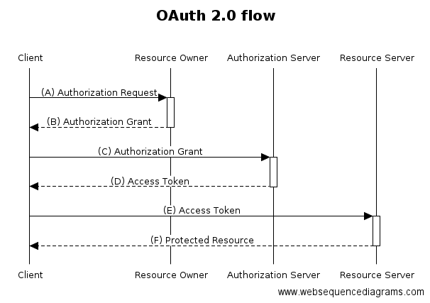

# Thing+ oAuth2 가이드
3rd party에서 Thing+ 자원을(resource) 이용하기 위한 authentication/authorization 획득 과정에 대한 가이드 

## Before description

## 사전 준비
1. API를 테스트 하기 위한 툴
 - DHC, Postman, etc
2. authClient 생성
 - api guide의 authClients 항목을 참조하여 authClient를 생성
 - 생성된 authClient는 3rd party 업체에서 관리
 
 
## Authorization Code 방식
생성한 authClient에서 특정 user의 지정된 권한에 대한 위임을 받는다
 
1. 뭐한다
2. 뭐한다
3. 뭐한다
4. 획득한 토큰을 API에서 이용한다
5. 위의 과정을 앱 또는 클라이언트에서 개발한다

## Resource Owner Password Credentials 방식

1. 뭐한다
4. 획득한 토큰을 API에서 이용한다
5. 위의 과정을 서버에서 개발하도록 한다